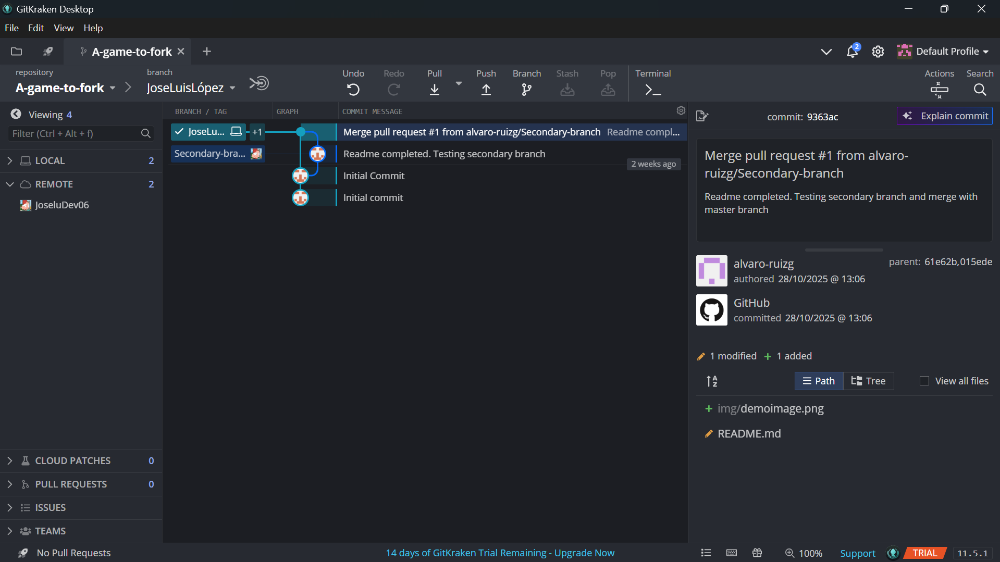
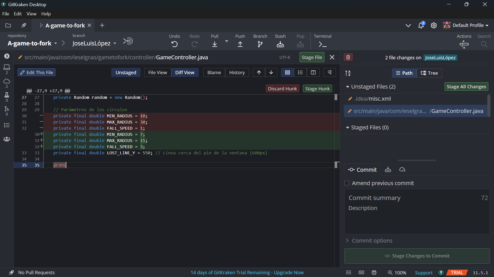
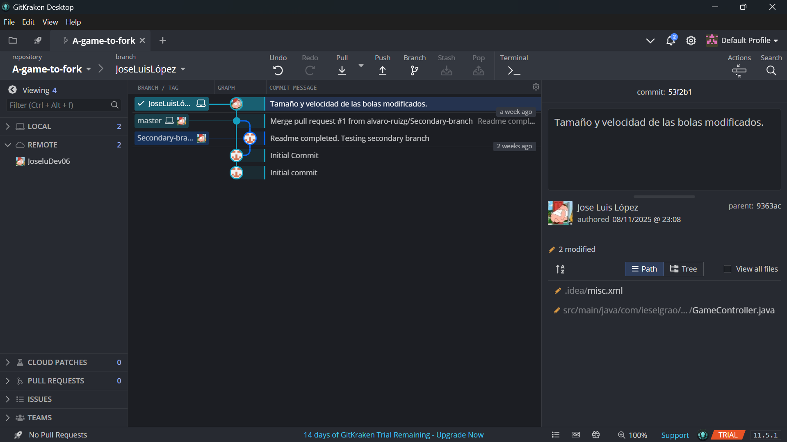
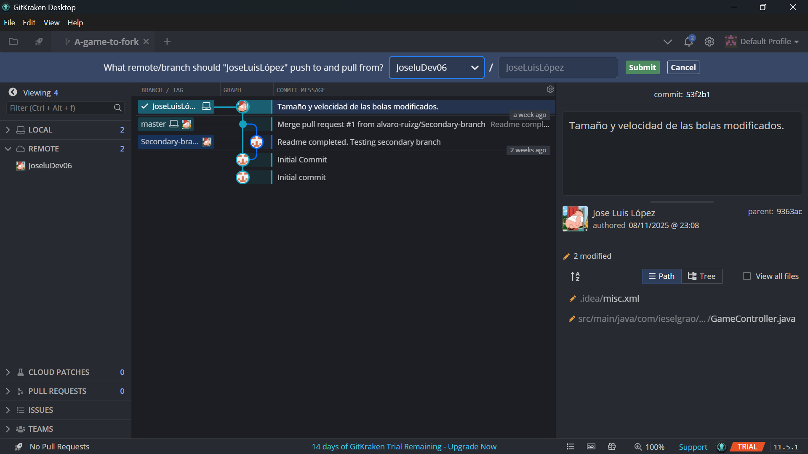
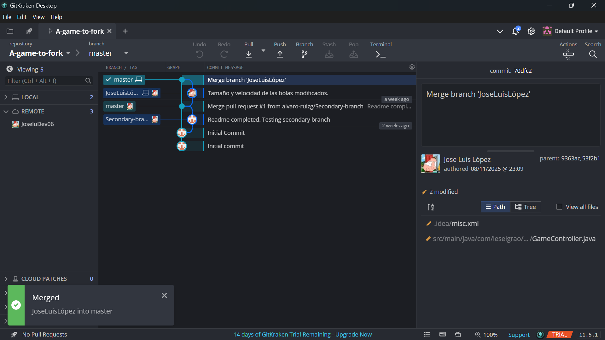

# Ejercicio 2 GIT -- Entornos de Desarrollo

## Funcionalidades añadidas:
- Velocidad de las bolas aumentada.  
- Tamaño de las bolas reducido.

## Proceso:

  

Una vez he vinculado la cuenta de GitHub con GitKraken, he clonado el repositorio, he cambiado el remote y he hecho mi propia rama.  

  

He cambiado los valores de la velocidad, radio máximo y mínimo de las bolas.  

  

Hago un stage y un commit de los cambios, con un breve comentario explicativo de mi trabajo.  

  

Hago un push a mi repositorio.  

  

Fusiono la rama que había creado con la rama main tras comprobar que todo está en orden.
